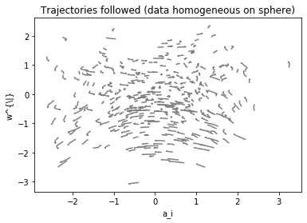
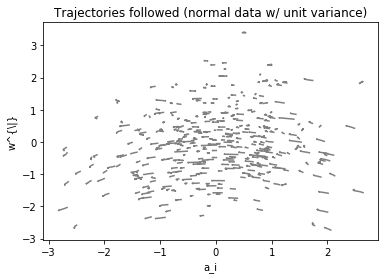
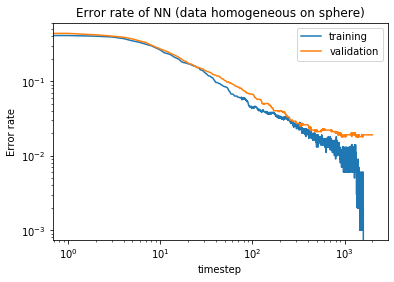
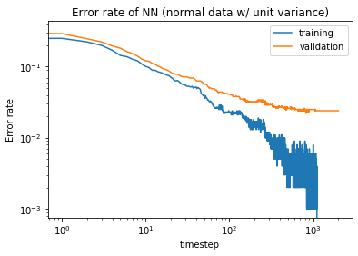

# shallow_dynamics_experiments
Reproduction des graphes de l'article "An analytic theory of shallow networks dynamics for hinge loss classification"

Dans ce notebook, nous reproduisons certains des graphes de l'article. En particulier, étudions l'impact du dataset dans l'apprentissage du réseau : en effet, sous l'hypothèse de séparabilité linéaire et de symmétrie sphérique des données,
on trouve l'équation (13) et (14) pour l'évolution des a_i(t) et w_i(t), quelque soit la distribution des données. La trajectoire sera donc la même, la différence sera dans 
la variable \gamma(t) qui détermine la vitesse d'évolution des a(t), w(t). 
Ici, nous prenons un premier dataset où x est distribué uniformément sur la sphère unité de R^d et un deuxième où x suit une loi normale de variance 1.

Ci-dessous, nous traçons la trajectoire des paramètres comme dans la figure 2 de l'article. A première vue, on semble avoir des résultats similaires à l'article

 

Ci-dessous, la courbe de l'erreur pour les deux datasets sur le training et validation set. Comme dans la figure 3, nous observons que l'erreur sur le validation set stagne tandis que 
l'erreur sur le training set continue de diminuer. La forme de la courbe orange est la même pour les deux datasets, ce qui s'explique par la forme de l'équation (12) de l'article.

